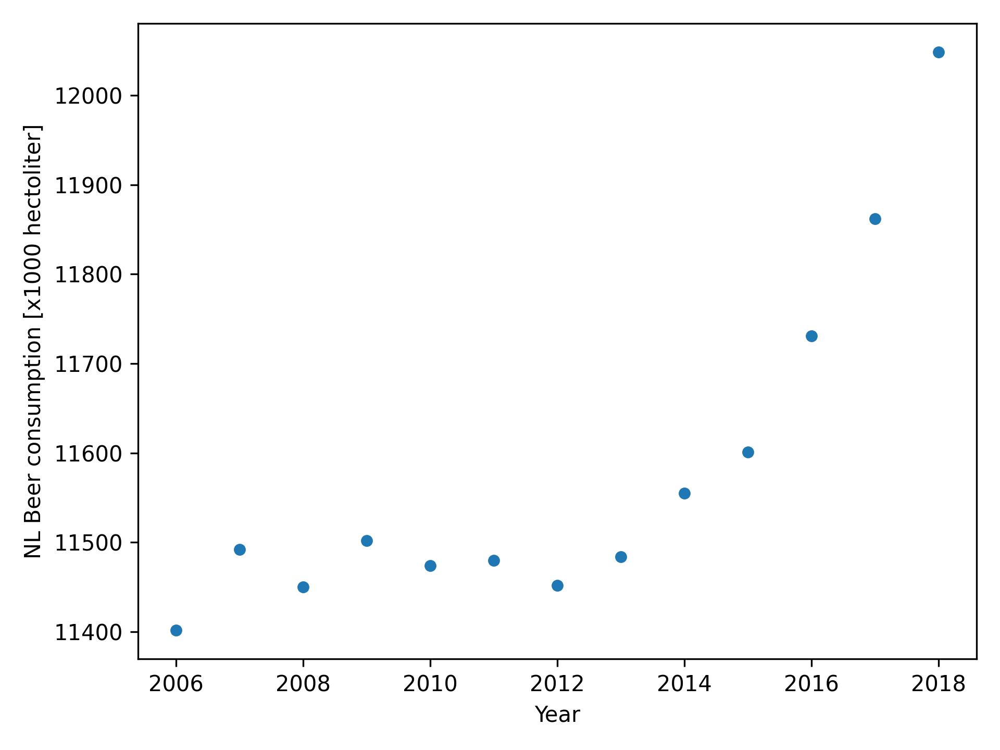

# student id: 16674588
#  - MCC Van Dyke et al., 2019
# - JT Harvey, Applied Ergonomics, 2002
# - DW Ziegler et al., 2005

As time increases bear consumption seems to show a positive trend with respect to time.